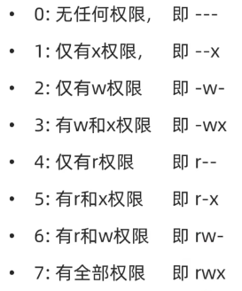
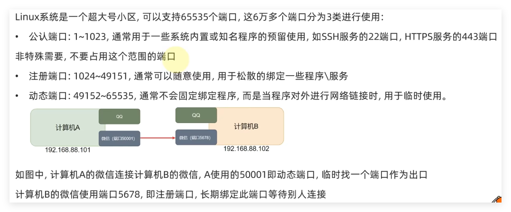
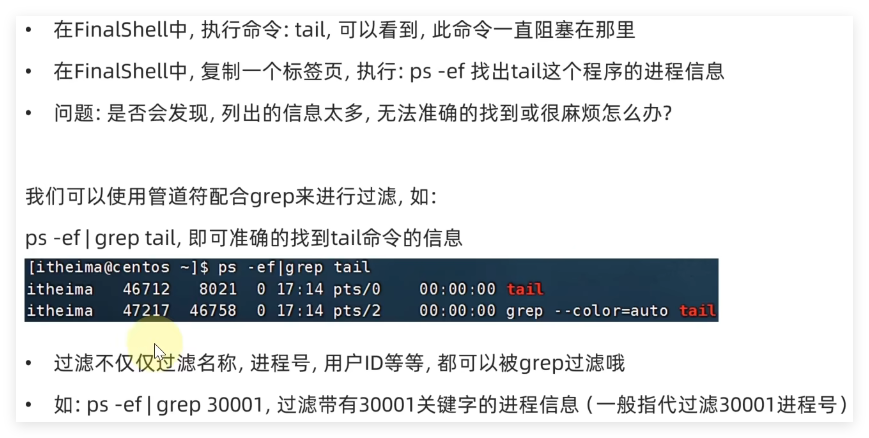

# Linux笔记


## 第一章_初识Linux


### 01_操作系统概述

#### 1.计算机由哪两个主要部分组成?

​	硬件和软件

#### 2.操作系统是什么?由什么作用?

​	操作系统是**软件**的一类。
​	主要作用是协助用户调度硬件工作，充当用户和计算机硬件之间的桥梁

#### 3.常见的操作系统有哪些?

​	PC端:Windows、Linux、MacOS
​	移动端:Android、l0S、鸿蒙系统


### 02_Linux初识

#### 1.Linux的诞生

- Linux由**林纳斯·托瓦兹**在1991年创立并发展至今成为服务器操作系统领域的核心系统。

#### 2.什么是Linux系统的内核

- 内核提供了Linux系统的主要功能，如硬件调度管理的能力。Linux内核是免费开源的，任何人都可以查看内核的源代码，甚至是贡献源代码。

#### 3.什么是Linux系统发行版

- 内核无法被用户直接使用，需要配合应用程序才能被用户使用。在内核之上，封装系统级应用程序，组合在一起就称之为Linux发行版。

#### 4.Linux系统的组成：

- Linux系统内核
  - 内核提供系统最核心的功能，如:调度CPU、调度内存、调度文件系统、调度网络通讯、调度IO等)
- 系统级应用程序
  - 可以理解为出厂自带程序，可供用户快速上手操作系统，如:文件管理器、任务管理器、图片查看、音乐播放等


### 03_虚拟机(VMware WorkStation，两主流CentOS 7和Ubuntu )

#### 1.FinalShell

- FinalShell，远程连接到Linux操作系统之上。
- 作用：
  - 通过FinalShell去操作Linux系统
  - 解决内容的复制、粘贴跨越VMware不方便、文件的上传、下载跨越VMware不方便
  - 即解决Linux系统的各类交互，跨越VMware不方便问题

- 连接方法：
  - 打开VMware中的linux虚拟机
  - 输入config，找到ens33里的inet地址
  - 然后在FinalShell里面打开文件夹选择SSH添加，输入地址，用户名密码即可连接


#### 2.虚拟机快照(记录当前虚拟机状态)


## 第二章_Linux基础命令


### 01_Linux的目录结构

#### 1、linux操作系统的目录结构

- Linux只有一个顶级目录，称之为：根目录
- Windows系统有多个顶级目录，即各个盘符


#### 2、/在Linux系统中表示（/usr/local/hello.txt）

- 出现在开头的/表示:根目录
- 出现在后面的/表示:层次关系


### 02_Linux命令入门

#### 1、Linux命令基础格式：

无论是什么命令，用于什么用途,在Linux中,命令有其通用的格式:

```
command [-options] [parameter]

command:命令本身
-options:[可选,非必填]命令的一些选项,可以通过选项控制命令的行为细节
parameter:[可选,非必填]命令的参数,多数用于命令的指向目标等
```

语法中的[],表示可选的意思
示例:

- ls -l /home/xier，ls是命令本身，-l是选项，/home/xier是参数
  - 意思是以列表的形式，显示/home/xier目录内的内容

- cp -r test1 test2，cp是命令本身，-r是选项，test1和test2是参数
  - 意思是复制文件夹test1 成为 test2


#### 2、ls命令入门：

```
1) ls命令的作用

在命令行中，以平铺的形式,展示当前工作目录(默认HOME目录)下的
内容(文件或文件夹)

2) HOME目录

每一个用户在Linux系统的专属目录，默认在:/home/用户名

3) 当前工作目录

Linux命令行在执行命令的时候，需要一个工作目录,打开命令行程序(终端)默认设置工作目录在用户的HOME目录
```


#### 3、ls命令的参数和选项：

##### 1) ls命令的语法：

```
ls [-a -1 -h] [Linux路径]

-a选项，表示:all的意思，即列出全部文件(包含隐藏的文件/文件夹，结果中前面带.的就是隐藏文件)
-l选项，表示:以列表(竖向排列)的形式展示内容，并展示更多信息

-h表示以易于阅读的形式，列出文件大小，如K、M、G
-h选项必须要搭配 -l 一起使用

(选项是可以组合使用的，例如，ls -l -a ，ls -al ， ls -la)

说明：
	1）当ls不使用参数,表示列出:当前工作目录的内容,即用户的HOME目录
	2）当使用参数，ls命令的参数表示:指定一个Linux路径,列出指定路径的内容
```


### 03_-cd-pwd命令

#### 1）cd命令(Change Directory)

```
语法：cd [Linux路径]

作用：
	切换目录

说明：
	cd命令无需选项，只有参数，表示要切换到哪个目录下
	cd命令直接执行，不写参数，表示回到用户的HOME目录
```

#### 2）pwd命令(Print Work Directory)

```
语法：pwd

作用：
	查看当前所在目录

说明：
	pwd命令，无选项，无参数，直接输入pwd即可
```


### 04_相对路径、绝对路径和特殊路径符

#### 1）绝对路径：

​	以**根目录**为起点，描述路径的一种写法，路径描述以/开头(**cd /home/xier/Desktop)**

#### 2）相对路径：

​	以**当前目录**为起点，描述路径的一种写法，路径描述无需以/开头(**cd Desktop**)

#### 3）特殊路径符：

- .	表示**当前目录**，比如 cd./Desktop 表示切换到当前目录下的Desktop目录内，和cd Desktop效果一致
- ..       表示**上一级目录**，比如: cd.. 即可切换到上一级目录，cd./..切换到上二级的目录
- ~      表示**HOME目录**，比如: cd~  即可切换到HOME目录或cd~/Desktop，切换到HOME内的Desktop目录


### 05_mkdir命令：

```
语法：mkdir [-p] linux路径

作用：
	创建新的目录(文件夹)

说明：
	参数必填，表示Linux路径，即要创建的文件夹的路径，相对路径或绝对路径均可
	-p选项可选，表示自动创建不存在的父目录，适用于创建连续多层级的目录
	(mkdir itcast/good/999会报错，因为itcast，good都不存在，无法创建999)
	(mkdir -p itcast/good/999 则可创建整一个链条)、
	
注意：
	创建目录所需要的权限较大，故无法在当前用户home之外的目录操作
	(详细会在权限管理后说明及解决)
```


### 06_touch，cat，more命令

#### 1）touch命令

```
语法：touch Linux路径

作用：
	创建文件

说明：
	touch命令无选项，参数必填，表示要创建的文件路径，相对、绝对、特殊路径均可以使用
```

#### 2）cat命令

```
语法：cat Linux路径

作用：
	查看文件内容(直接将内容全部显示出来)

说明：
	cat同样没有选项，只有必填参数，参数表示:被查看的文件路径，相对、绝对、特殊路径符都可以使用
```

#### 3）more命令

```
语法：more Linux路径

作用：
	查看文件内容(支持翻页，若文件内容过多，可以一页一页展示，空格下一页，Q退出查看)

说明：
	more同样没有选项，只有必填参数，参数表示:被查看的文件路径，相对、绝对、特殊路径符都可以使用
```


### 07_cp，mv，rm命令

#### 1）cp命令(copy)

```
语法: cp[-r]参数1 参数2

作用：
cp命令可以用于复制文件\文件夹

说明：
	-r选项，可选，用于复制文件夹使用，表示递归(用于复制文件夹)
	参数1，Linux路径，表示被复制的文件或文件夹
	参数2，Linux路径，表示要复制去的地方
```

#### 2）mv命令(move)

```
语法: mv 参数1 参数2

作用：
mv命令可以用于移动文件\文件夹

说明：
	参数1，Linux路径，表示被移动的文件或文件夹
	参数2，Linux路径，表示要移动去的地方，如果目标不存在，则进行改名，确保目标存在
	(会将参数1的文件改名)
```

#### 3）rm命令(remove)

```
语法: rm [-r -f] 参数1 参数2 ...... 参数N

作用：
rm命令可用于删除文件、文件夹

说明：
	同cp命令一样，-r选项用于删除文件夹
	-f表示force，强制删除(不会弹出提示确认信息)
		普通用户删除内容不会弹出提示，只有root管理员用户删除内容会有提示
		所以一般普通用户用不到-f选项
	参数1、参数2、...... 、参数N 表示要删除的文件或文件夹路径，按照空格隔开
```

##### （1）通配符删除

- rm命令支持**通配符 ***，用来做**模糊匹配** 
- 符号 * 表示通配符，即匹配任意内容(包含空)，示例：
  - test* ，表示匹配任何以test开头的内容
  - *test，表示匹配任何以test结尾的内容
  -  *test *，表示匹配任何包含test的内容(中间无空格，md文档中**会斜体字)

```
注意：
	rm是一个危险命令，在root用户的时候
	千万不要运行
	rm -rf /
	rm -rf /*
	等同于windows上执行c盘格式化
```


### 08_which、find命令

#### 1）which命令

```
前面学习的Linux命令，其实它们的本体就是一个个的二进制可执行程序
和Windows系统中的.exe文件，是一个意思

作用：
	可以通过which命令，查看所使用的一系列命令的程序文件存放在哪里
	
语法:which 要查找的命令
```

#### 2）find命令(可以用通配符搜索)

```
作用：
    可以通过find命令去搜索指定的文件
    
语法:find 起始路径 -name "被查找文件名"

说明：
	为尽可能的扩大搜索范围，可以转换为root用户，进行整一个系统搜索
```

##### （1）按文件大小查找文件

```
语法:find 起始路径 -size +n[kMG]

说明：
	+、-表示大于和小于
	n表示大小数字
	kMG表示大小单位，k(小写字母)表示kb，M表示MB，G表示GB
示例:
查找小于10KB的文件:find / -size -10k
查找大于100MB的文件:find / -size +100M
查找大于1GB的文件:find / -size +1G
```


### 09_grep、wc、管道符

#### 1）grep命令

```
语法: grep [-n] 关键字 文件路径

作用：
	可以通过grep命令，从文件中通过关键字过滤文件行。

说明：
	选项-n，可选，表示在结果中显示匹配的行的行号。
	参数，关键字，必填，表示过滤的关键字，带有空格或其它特殊符号，建议使用""将关键字包围起来
	参数，文件路径，必填，表示要过滤内容的文件路径，可作为内容输入端口
	
输出结果：
	若成功过滤到关键字，则将关键字当前所在行输出出来，且关键字标红，加-n，则前面有行号
```

#### 2）wc命令

```
语法:wc [-c-m-1 -w] 文件路径

作用：
	可以通过wc命令统计文件的行数、单词数量等

说明：
    选项，-c，统计bytes数量
    选项，-m，统计字符数量
    选项，-l，统计行数
    选项，-w，统计单词数量
    参数，文件路径，被统计的文件，可作为内容输入端口
    
输出结果：
	若直接wc test.txt，则输出 行数 单词书 字节数 文件名
```

#### 3）管道符|

```
管道符:
	|
管道符的含义是:
	将管道符左边命令的结果，作为右边命令的输入

例如：
	cat xier.txt | grep xier
	其中，
	cat xier.txt（查看输出的文件内容）
	作为，
	grep xier(输入的过滤文件)
```


### 10_echo,反引号,tail,重定向符号

#### 1）echo命令

```
语法:echo 输出的内容

作用：
	可以使用echo命令在命令行内输出指定内容

说明：
    无需选项，只有一个参数，表示要输出的内容，复杂内容可以用""包围
    
输出结果：
	echo "hello Linux"，则命令行中输出hello Linux
```

##### （1）反引号

```
举例：echo pwd -> 想输出当前工作路径，但是pwd被当普通字符输出了

语法：echo `pwd`

说明：
	被``包围的内容，会被视作命令执行
```


#### 2）重定向符号

```
重定向符:>和>>

说明：(只要是能产生结果的命令，都能放入左边，例如ls)
	>,将左侧命令的结果，覆盖写入到符号右侧指定的文件中
	>>，将左侧命令的结果，追加写入到符号右侧指定的文件中
	
举例：
	echo "hello xier" > xier.txt
	若文件本来有内容，会直接覆盖掉
	echo "hello xier" >> xier.txt
	若文件本来有内容，会在后面追加新加入的内容
```


#### 3）tail命令

```
语法：tail [-f -num] Linux路径

作用：
	使用tail命令，可以查看文件尾部内容，跟踪文件的最新更改

说明：
    参数，Linux路径，表示被跟踪的文件路径
    选项，-f，表示持续跟踪，ctrl+c可以强制停止跟踪
    选项,-num，表示，查看尾部多少行，不填默认10行，num换成具体的数字
```


### 11_vi/vim编辑器

#### 1）三种工作模式

- 命令模式
  - 命令模式下，所敲的按键编辑器都理解为**命令**，以命令驱动执行**不同的功能**。此模型下，不能自由进行文本编辑。


- 输入模式
  - 也就是所谓的**编辑模式**、插入模式。此模式下，可以对文件内容进行自由编辑。
- 底线命令模式
  - 以 : 开始，通常用于文件的保存、退出。


#### 2）基础命令：

```
语法：vim 文件路径
	 vi  文件路径
	 
说明：
	1.什么是vi/vim编辑器
		vi\vim编辑器，就是命令行模式下的文本编辑器，用来编辑文件
		vim是vi的升级版，一般用vim即可，包含全部vi功能
```


## 第三章_Linux权限管理


### 01_Linux的root用户

#### 1）超级管理员root

>普通用户的权限，一般在其HOME目录内是不受限的
>一旦出了HOME目录,大多数地方,普通用户仅有只读和执行权限,无修改权限

- **root用户**拥有**最大**的系统操作权限,而**普通用户**在许多地方的权限是**受限**的。

#### 2）su命令(Switch User)

```
语法:su [-] [用户名]

说明：
	-符号是可选的,表示是否在切换用户后加载环境变量，建议带上
	参数:用户名,表示要切换的用户,用户名也可以省略,省略表示切换到root
	切换用户后，可以通过exit命令退回上一个用户,也可以使用快捷键:ctrl+d
```

#### 3）sudo命令

##### （1）语法及说明：

```
语法:sudo 其它命令

作用：
	su命令可以切换到root得到最大权限。
	但是不建议长期使用root用户,避免带来系统损坏。
	可以使用sudo命令,为普通的命令授权，临时以root身份执行。

说明：
	在其它命令之前，带上sudo,即可为这一条命令临时赋予root授权
	但是并不是所有的用户,都有权利使用sudo,我们需要为普通用户配置sudo认证
```

##### （2）配置sudo认证：


### 02_用户和用户组

#### 1）Linux用户管理模式

- Linux可以支持多用户、多用户组、用户加入多个组
- Linux权限管控的单元是**用户级别**和**用户组级别**

#### 2）用户组管理命令：


#### 3）用户管理命令：


```
举例：
(若创建用户时没有-g指定组，则创建一个用户名同名的组并加入)
创建用户：useradd test1 -g itcast -d /home/test123

删除用户：userdel -r test1

查看用户所属组：id test1

修改用户所属组：usermod -aG itcast test1
```

#### 4）getent命令：

##### （1）getent passwd

- 可以查看系统中有那些用户


```
查看到的用户信息，有7份信息：

用户名 : 密码(x) : 用户ID : 组ID : 描述信息(无用) : HOME目录 : 执行终端(默认bash，后面学习)
```

##### （2）getent group

- 同样可以查看系统中有那些用户


```
包含3份信息：

组名称 : 组认证(显示为x) : 组ID
```


### 03_查看权限控制信息

#### 1）ls -l 列出的权限信息如何解读


#### 2）权限细节解读


#### 3）rwx含义

- r表示**读权限**
- w表示**写权限**
- x表示**执行权限**

```
针对文件、文件夹的不同，rwx的含义有细微差别
	r,针对文件可以查看文件内容
		针对文件夹，可以查看文件夹内容，如ls命令
	W,针对文件表示可以修改此文件
		针对文件夹，可以在文件夹内:创建、删除、改名等操作
	x,针对文件表示可以将文件作为程序执行
		针对文件夹，表示可以更改工作目录到此文件夹，即cd进入
```


### 04_chmod命令

```
语法：chmod [-R］权限 文件或文件夹

作用：使用chmod命令，修改文件、文件夹的权限信息。

说明：
	只有文件、文件夹的所属用户或root用户可以修改。
	-R，对文件夹内的全部内容应用同样的操作
示例:
	chmod u=rwx,g=rx,O=x hello.txt，将文件权限修改为:rwxr-x--x
		其中:u表示user所属用户权限,g表示group组权限,o表示other其它用户权限
	chmod -R u=rwx,g=rx,O=x test, 将文件夹test以及文件夹内全部内容权限设置为:rwxr-x--x
```

#### 1）快捷写法：

- chmod **751** hello.txt
  - 其中u = 7 ，g = 5 ，o = 1
  - 权限可以用数字表示：**r 为 4 ，w 为 2 ， x 为 1**。




### 05_chown命令：

```
语法：chown [-R] [用户][:][用户组］文件或文件夹

作用：使用chown命令，可以修改文件、文件夹的所属用户和用户组

说明：
	普通用户无法修改所属为其它用户或组，所以此命令只适用于root用户执行
	选项,-R,同chmod,对文件夹内全部内容应用相同规则
	选项,用户,修改所属用户
	选项,用户组,修改所属用户组
	:用于分隔用户和用户组
示例:
	chown root hello.txt, 将hello.txt所属用户修改为root
	
    chown :root hello.txt, 将hello.txt所属用户组修改为root
    
    chown root:itheima hello.txt,将hello.txt所属用户修改为root,用户组修改为itheima
    
    chown -R root test,将文件夹test的所属用户修改为root并对文件夹内全部内容应用同样规则
	

```


## 第四章_Linux的实用操作


### 01_各类小技巧快捷键

- **ctrl + c** 强制停止
- **ctrl + d** 退出登出
- **history** 查看历史命令
- **！命令前缀**，自动匹配上一个命令
- **ctrl +r**,搜索历史命令，回车运行搜到的命令，键盘左右键提取命令
- **ctrl + a│e,**光标移动到命令开始或结束
- **ctrl+ ←|→ **,左右跳单词，这里的左右是鼠标左右键
- **ctrl +L或clear**命令清展


### 02_软件安装

>因Centos7官方yum源已停止维护，所以无法进行软件安装，但是可以自行配置国内yum源
>
>教程：[Centos7配置本地Yum源以及网络YUM源（保姆级）_centos7yum源-CSDN博客](https://blog.csdn.net/2302_77228926/article/details/139559880)

#### 1）CentOS软件安装

```
yum:RPM包软件管理器，用于自动化安装配置Linux软件，并可以自动解决依赖问(软件安装包叫.rpm)

语法：yum [-y] [install | remove | search] 软件名称

选项：-y,自动确认，无需手动确认安装或卸载过程
	install: 安装
	remove:卸载
	search:搜索

注意：
	yum命令需要root权限，可以su切换到root,或使用sudo提权。
	yum命令需要联网
```

#### 2）Ubuntu软件安装

```
前面学习的各类Linux命令，都是通用的。但是软件安装，CentOs系统和Ubuntu是使用不同的包管理器。（.deb）
	CentOs使用yum管理器,Ubuntu使用apt管理器
	
语法:apt [-y] [install | remove | search] 软件名称

选项
    · apt install wget, 安装wget
    · apt remove wget, 移除wget
    · apt search wget, 搜索wget

注意：
	用法和yum一致，同样需要root权限
```


### 03_systemctl控制软件启动和关闭

- Linux系统很多软件（内置或第三方）均支持使用systemctl命令控制:**启动、停止、开机自启**
- 能够被systemctl管理的软件，一般也称之为：**服务**

```
语法:systemctl start | stop | status| enable | disable 服务名
```

- 系统内置的服务比较多，比如:
  - NetworkManager,主网络服务
  - network,副网络服务
  - firewalld,防火墙服务
  - sshd,ssh服务（FinalShell远程登录Linux使用的就是这个服务）

```
除了内置的服务以外，部分第三方软件安装后也可以以systemctl进行控制。(安装后，后面加个d)

例如：
1、yum install -y ntp,安装ntp软件
可以通过ntpd服务名，配合systemctl进行控制

2、yum install -y httpd, 安装apache服务器软件
可以通过httpd服务名，配合systemctl进行控制

部分软件安装后没有自动集成到systemctl中，我们可以手动添加。
```


### 04_软链接

- 在系统中创建软链接，可以将文件、文件夹**链接**到其它位置，类似windows系统中的《**快捷方式**》。

```
语法：ln -s 参数1 参数2

    -s选项，创建软连接
    参数1：被链接的文件或文件夹
    参数2:要链接去的目的地
    
实例:
    ln -s /etc/yum.conf ~/yum.conf
    ln -s /etc/yum ~/yum
```


### 05_日期和时区

#### 1）date命令的作用和用法

- date命令可以查看日期时间，并可以格式化显示形式以及做日期计算

```
语法：date [－d] [+格式化字符串]

格式化字符：
	%Y 年
    %y 为年份后两位数字(00，99)
    % 月份(01,12)
    %d 日 (01,31)
    %H 小时 (00.23)
    %M 分钟 (00,59)
    %S 秒 (00,60)
    %s 自 1970-01-01 000000 UTC 到现在的秒数
    
可以通过双引号字符串来限制输出的时间格式

-d选项：进行日期加减
```


#### 2）如何修改Linux时区

```
rm -f /etc/localtime
sudo ln -s /usr/share/zoneinfo/Asia/Shanghai /etc/localtime
```


#### 3）ntp的作用(需yum下载)

我们可以通过ntp程序**自动**校准系统时间

```
安装ntp: yum -y install ntp

启动并设置开机自启：
    systemctl start ntpd
    systemctl enable ntpd
    
当ntpd启动后会定期的帮助我们联网校准系统的时间

也可以手动校准（需root权限): ntpdate -u ntp.aliyun.com

通过阿里云提供的服务网址配合ntpdate（安装ntp后会附带这个命令）命令自动校准
```


### 06_IP地址，主机名，域名解析和虚拟机配置固定IP

#### 1）IP地址

- 每一台联网的电脑都会有一个地址，用于和其它计算机进行通讯
- IP地址主要有2个版本，V4版本和V6版本（V6很少用）
- IPv4版本的地址格式是:**a.b.c.d**, 其中abcd表示0~255的数字,如**192.168.88.101**就是一个标准的IP地址
- 以通过命令: **ifconfig**,查看本机的ip地址(inet),如无法使用ifconfig命令，可以安装:yum-y install net-tools

##### （1）特殊IP地址：

- 127.0.0.1，这个IP地址用于指代**本机**
- 0.0.0.0，特殊IP地址
  - 可以用于指代**本机**
  - 可以在端口绑定中用来确定绑定关系
  - 在一些IP地址限制中，表示所有IP的意思，如放行规则设置为0.0.0.0，表示允许任意IP访问


#### 2）主机名

- hostname 
  - 查看主机名
- hostnamectl set-hostname 主机名           
  - 修改主机名（需root）
- 重新登陆FinalShell即可看见新主机名


#### 3）域名解析

>  域名 可以通过主机名或替代的字符地址去代替数字化的IP地址
> 比如,我们在浏览器内打开:www.baidu.com,会打开百度的网址
> 其中,www.baidu.com,是百度的网址,我们称之为:域名

##### （1）解析流程


#### 4）虚拟机配置固定IP

##### （1）固定IP的原因

- 当前我们虚拟机的Linux操作系统，其IP地址是通过**DHCP服务**获取的。
- **DHCP**:动态获取IP地址，即每次重启设备后都会获取一次，可能导致IP地址频繁变更
  - 原因1：办公电脑IP地址变化无所谓，但是我们要远程连接到Linux系统，如果IP地址经常变化我们就要频繁修改适配很麻烦
  - 原因2:在刚刚我们配置了虚拟机IP地址和主机名的映射，如果IP频繁更改，我们也需要频繁更新映射关系
    综上所述，我们需要IP地址固定下来，不要变化了。

##### （2）固定虚拟机IP的步骤

- 子网范围是 .0 ~ .254，88是指网段可以任何修改


### 07_网络传输

#### 1）网络请求和下载

##### （1）ping命令

```
作用：
	可以通过ping命令，检查指定的网络服务器是否是可联通状态
	
语法:ping [-c num] ip或主机名

说明：
	选项：-c,检查的次数,不使用-c选项,将无限次数持续检查
	参数:ip或主机名，被检查的服务器的ip地址或主机名地址
```

##### （2）wget命令

```
作用：
	wget是非交互式的文件下载器，可以在命令行内下载网络文件
语法：wget [-b] url

说明：
	选项:-b,可选,后台下载,会将日志写入到当前工作目录的wget-log文件
	参数:url,下载链接
```


##### （3）curl命令

```
作用：
	curl可以发送http网络请求,可用于：下载文件、获取信息等
语法：curl [-O] url

说明：
	选项：-O,用于下载文件，当url是下载链接时，可以使用此选项保存文件
	参数:url,要发起请求的网络地址
```


#### 2）端口

- 端口，是设备与外界通讯交流的出入口。端口可以分为：物理端口和虚拟端口两类
  - **物理端口**:又可称之为接口,是可见的端口，如USB接口，RJ45网口，HDMI端口等
  - **虚拟端口**：是指计算机内部的端口，是不可见的，是用来操作系统和外部进行交互使用的

##### （1）端口作用：


##### （2）端口原理及分类：



##### （3）查看端口占用

- 查看指定IP的对外暴露的端口


- 查看本机**指定**端口的占用情况


### 08_进程管理

#### 1）查看进程

```
作用：
	可以通过ps命令查看Linux系统中的进程信息
	
语法:ps [-e -f]

说明：
	选项：-e，显示出全部的进程
	选项：-f,以完全格式化的形式展示信息（展示全部信息）
	一般来说，固定用法就是：ps -ef列出全部进程的全部信息
```


#### 2）查看指定进程(过滤、管道符)



#### 3）关闭进程

```
在Windows系统中，可以通过任务管理器选择进程后，点击结束进程从而关闭它。
同样，在Linux中，可以通过kill命令关闭进程。

语法：ki11 [-9] 进程ID

说明：
	选项：-9，表示强制关闭进程。不使用此选项会向进程发送信号要求其关闭，但是否关闭看进程自身的处理机制。
```


### 09_主机状态监控


#### 1）查看系统资源占用(top)

```
作用：
	可以通过top命令查看CPU、内存使用情况，类似windows的任务管理器,默认每5秒刷新一次
	
语法：直接输入top即可，按q或ctrl+c退出

选项：
	-p 只显示某个进程的信息
    -d 设置刷新时间，默认是5s
    -C 显示产生进程的完整命令，默认是进程名
    -n 指定刷新次数，比如top -n 3，刷新输出3次后退出
    -b 以非交互非全屏模式运行，以批次的方式执行top，一般配合-n指定输出几次统计信息，将输出重定向到指
    定文件，比如 top -b -n 3 > /tmp/top.tmp
    -i 不显示任何闲置（idle）或无用（zombie）的进程
    -u 查找特定用户启动的进程
```

##### （1）top内容详解


##### （2）top交互式选项


#### 2）磁盘信息监控

##### （1）硬盘使用情况（df）

```
作用：
	使用df命令，可以查看硬盘的使用情况
语法： df [-h]

选项：-h,以更加人性化的单位显示
```


##### （2）cpu、磁盘的相关信息（iostat）


#### 3）网络状态监控(sar)


### 10_环境变量

>在学习which命令的时候，我们知道使用的一系列命令其实本质上就是一个个的可执行程序。
>比如,cd命令的本体就是：/usr/bin/cd这个程序文件。
>
>为何无论当前工作目录在哪里，都能执行：/usr/bin/cd这个程序呢?
>这就是环境变量的作用。

#### 1）环境变量查看（env）

- 语法：env
  - 查看当前系统中记录的环境变量
  - 环境变量是一种KeyValue型结构(键=值)


#### 2）$符号


#### 3）自行设置环境变量(export)

- 临时设置只要退出当前终端就失效。


#### 4）自定义环境变量PATH


### 11_Linux文件的上传和下载

#### 1）使用FinalShell工具上传和下载(拖拽)


- 需要注意的是，FinalShell下面的文件栏目的权限是取决于FinalShell设置里面登陆的账号的。
  - 进入root：点设置编辑，然后将root账密输入，即可查看其他文件夹。


#### 2）rz、sz命令（不自带）


### 12_压缩和解压(tar、gzip、zip)

#### 1）tar命令

> Linux和Mac系统常用有2种压缩格式,后缀名分别是：（这两种格式可以用tar压缩或解压缩）
> 	.tar，称之为tarball，归档文件，即简单的将文件组装到一个.tar的文件内，并没有太多文件体积的减少，仅仅是简单的封装
> 	.gz，也常见为.tar.gz，gzip格式压缩文件，即使用gzip压缩算法将文件压缩到一个文件内，可以极大的减少压缩后的体积

```
语法: tar [-c -V -x -f -z -C] 参数1 参数2 ... 参数N

	-c，创建压缩文件，用于压缩模式
	-V,显示压缩、解压过程,用于查看进度
	-x, 解压模式
	-f,要创建的文件，或要解压的文件，-f选项必须在所有选项中位置处于最后一个（重要）
	-Z, gzip模式,不使用-z就是普通的tarball格式
	-C,选择解压的目的地,用于解压模式
```

##### （1）压缩(c)


##### （2）解压(x)


#### 2）zip命令

##### （1）压缩(zip)

```
语法：zip [-r] 参数1 参数2 ... 参数N

	-r,被压缩的包含文件夹的时候，需要使用-r选项，和rm、cp等命令的-r效果一致

示例:
    zip test.zip a.txt b.txt c.txt
    将a.txt b.txt c.txt压缩到test.zip文件内
    zip -r test.zip test itheima a.txt
    将test、itheima两个文件夹和a.txt文件，压缩到test.zip文件内
```


##### （2）解压(unzip)

```
语法：unzip [-d] 参数

    -d,指定要解压去的位置,同tar的-C选项
    参数,被解压的zip压缩包文件
    
示例:
    unzip test.zip,将test.zip解压到当前目录
    unzip test.zip -d /home/itheima,将test.zip解压到指定文件夹内（/home/itheima)
```

