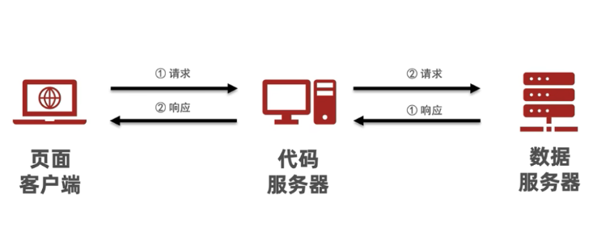
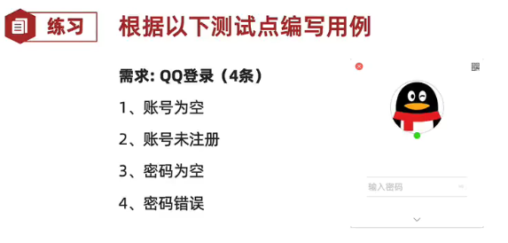
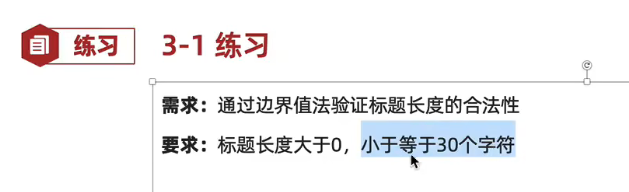
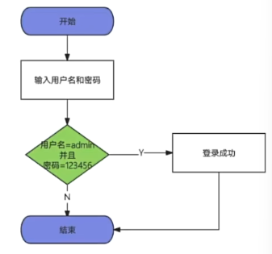

# 测试基础理论+Web手工测试+App手工测试


**拓展：**AI辅助生成测试用例指令

- 角色
- 指示(需求)
- 例子(有最好，没有也可)
- 输入(任务的输入信息，例如SQL注入、兼容性测试、功能测试)
- 输出(输出的格式描述，例如excel表格)


---------


## 一、测试的一些基本概念


### 1.软件和软件测试的概念：

​	**软件**是控制计算机硬件工作的工具

​	**软件测试**是使用技术手段验证软件是否满足使用需求


### 2.软件测试的目的：

​	发现软件缺陷(bug)，验证需求是否实现，评估软件质量(功能/性能/安全)


### 3.软件的基本组成：

​	

### 4.测试的主流技术：

- **功能测试**：测试主要验证程序的**功能**是否满足需求
- **自动化测试**：使用**代码或工具**代替手工，对项目进行测试
- **接口测试**：使用代码或工具验证程序中的**接口**是否访问正常
- **性能测试**：模拟**多人**使用软件，查找服务器缺陷


### 5.测试分类(重要)：

#### 1）按阶段

- **单元测试**：针对程序源代码进行测试(开发者)
- **集成测试**：又称接口测试，针对模块之间访问地址进行测试(模块交互)
- **系统测试**：对整个系统进行测试包括功能、兼容、文档等测试(全流程)
- **验收测试**：主要分为内测、公测，使用不同人群来发掘项目缺陷(客户)

#### 2）按代码可见度划分

- **黑盒测试**

1. 源代码不可见
2. UI功能可见

- **灰盒测试**

1. 部分源代码可见
2. 功能不可见

- **白盒测试**

1. 全部代码可见
2. UI功能不可见

#### 3）其他测试

- **冒烟测试**：对核心功能的验证
  - 作用：保障提测内容具备可测性
- **回归测试**：对已修复bug\更新后对已测内容再次测试
  - 作用：保证bug修复、确保新功能对旧功能没有影响


### 6.软件质量模型：

- **功能性**：软件是否具备某方面的能力
- **性能**：多用户同时使用能否满足要求(时间、资源)
- **兼容性**：在不同的设备/平台上能否正常使用
- **易用性**：易学、易用、用户粘性好
- **安全**：敏感数据存储/传输安全
- 可靠性：长时间运行稳定，不出现异常
- 可移植性：应用系统升级/数据迁移方便
- 可维护性：运行过程出现问题维护操作是否方便


### 7.测试流程(测试生命周期)：

1. **需求分析**：确保各部门需求理解一致
2. **计划编写**：测什么、谁来测、怎么测
3. **用例设计**：验证项目是否符合需求的操作文档
4. **用例执行**：项目模块开发完成开始执行用例文档实施测试
5. **缺陷管理**：对的缺陷进行管理的过程
6. **测试报告**：实施测试结果文档


## 二、测试用例

### 1.测试用例：

- 为测试项目而设计的测试文档


### 2.测试用例的作用：

- 防止漏测

- 实施测试的标准

  

### 3.用例设计编写格式：


### 4.用例设计编写格式-说明：

- **用例编号**：项目_模块 _编号
- **用例标题**：预期结果(测试点)
- **项目/模块**：所属项目或模块
- **优先级**：表示用例的重要程度或影响力P0~P4(P0最高)
- **前置条件**：要执行此条用例，有哪些前置操作
- **测试步骤**：描述操作步骤
- **测试数据**：操作的数据，没有的话可以为空
- **预期结果**：期望达到的结果+不同角色隐性结果


### 5.案例_练习QQ登录(测试用例 _案例练习)



## 三、测试用例设计

### 1.对穷举场景设计测试点(等价类划分法)

1）等价类划分法

1. 说明：在所有测试数据中，具有某种**共同特征**的数据集合进行划分。

2. 分类：

   - **有效等价类**：满足需求的数据集合
   - **无效等价类**：不满足需求的数据集合

3. 步骤：

   1. 明确需求
   2. 确定有效和无效等价类(长度、类型和规则)
   3. 提取数据编写测试用例
      - **正向用例**：一条尽可能覆盖多条
      - **逆向用例**：每一条数据，都是一条单独用例。

   ```
   重点：有效等价和单个无效等价各取1个即可
   tips：完整的用例应该是等价类和边界值一块写。
   ```

   

4. **案例（在等价类用例_案例练习）：**

   

   

5. **案例实践(在等价类用例_案例练习)**

   )

6. 适用场景

   - 针对：需要有大量数据测试输入，但是没法**穷举测试**的地方
     - 输入框
     - 下拉列表
     - 单选复选框
   - 典型代表：页面输入框类测试。


### 2.解决边界限制问题(边界值分析法)

>说明：使用边界值解决界位数限制问题。

1. 边界范围节点：
   - **上点**：边界上的点(正好等于)
   - **离点**：距离上点最近的点(刚好大于、刚好小于)
   - **内点**：范围内的点(区间范围内的数据)


```
提示：
	1、有关范围限制，最多7条用例(暂时未优化)
	2、边界值能解决位数限制问题，但不能解决类型问题(要结合等价类)
```

2.边界值法设计用例步骤：

```
1、明确需求
2、确定有效和无效等价类(类型)
3、确定边界范围值
4、提取数据编写测试用例
```

3.**标题边界案例(边界值_案例练习)**



4.**QQ号码边界案例（边界值_案例练习）**


5.边界值优化

>重点：开内闭外(开区间选包含的点，闭区间选不包含的点)
>
>开区间：不包含边界的店(没有等号)。如：0<a<10	(0,10)
>
>闭区间：包含边界上的店(有等号)。如：0<=a<=10	[0,10]

优化策略：

- 结论：**7个优化为5个点**
- 上点：必选(不考虑区间开闭)
- 内点：必选(建议选中间范围)
- 离点：**开内闭外**(考虑开闭区间，开区间选择内部离点，闭区间选择外部离点)

```
其实就是只选 一个范围之外 的点的优化方法。
```

6.使用场景：

> 强调：单个输入框，常用的方式 边界+等价类

```
在等价类的基础上去针对有边界范围的测试数据输入的地方(重点关注边界)
常见词语描述：大小、尺寸、重量、最大、最小、至多、至少等修饰词语
典型代表：有边界范围的输入框类测试
```


### 3.解决多条件有依赖关系测试(判定表法)

>重点：使用判定表

1. 判定表的概念

   

2. 判定表的步骤 

   ```
   1、明确需求
   2、画出判定表
   	1）列出条件桩和动作桩
   	2）填写条件项，对条件进行全组合
   	3）根据条件项的组合确定动作项
   	4）简化、合并相似规则(有相似动作)
   3、根据规则编写测试用例
   ```

   

3. 订购单检查案例（多条件依赖_判定表案例练习）

   

4. 文件修改规则案例（多条件依赖_判定表案例练习）

   

5. 使用场景

   - 有多个输入条件，多个输出结果，输入条件之间有**组合**关系，输入条件和输出结果之间有**依赖(制约)**关系
   - 判定表一般适用于**条件组合数量较少**的情况(比如4个条件以下)

```
提示：
	1、多条件之间有依赖关系，使用判定表来进行测试覆盖。
	2、判定表一般适合4个月内依赖关系。
	3、如果条件超4个，就不适合覆盖所有条件，应该采用(正交法)来解决。
```


### 4.业务测试覆盖(场景法)

> 重点：
>
> ​	1、覆盖业务测试，需要使用流程图法
>
> ​	2、先测试业务，再测试单功能、单模块、单页面

#### 4.1 概念

- 业务：是指软件为满足用户特定的业务需求而设计并实现的一系列功能。
  - 下单业务(登陆->搜索->添加购物车->下单->支付)
- 作用：测试软件系统单功能之间关联性数据处理逻辑是否正确
  - 例：添加购物车时对登陆状态的判断

#### 4.2 流程图




```
步骤：
	1、确认业务流程图
	2、流程图从开始到结束每条路径都是一条用例

作用：梳理业务用例

绘制流程图工具：Processon，Visio
```


#### 4.3 场景法

- 说明：
  - 场景法也可以叫**流程图法**，是用流程图描述用户的使用场景，然后通过**覆盖流程路径**来设计测试用例
- 意义：
  - 用户使用角度：用户平时使用的不是单个功能，而是多个功能组合起来进行使用。
  - 测试人员角度：平时测试的都是单个功能点进行测试，容易忽略多个功能的组合测试。


#### 4.4 发布文章业务案例


#### 4.5 提示

- 项目先测**主业务**再测单模块
- 提测时对主业务流程**正向用例**进行测试(**冒烟**)


### 5.错误推荐法(经验)

>应用场景：当项目用例都执行完毕，且BUG修复完毕，离上线还有一段时间，在这段时间中可以使用错误推荐法去复测主要业务或测试未覆盖的功能

- 定义：
  - 通过经验推测系统可能出现的问题
- 思想：
  - 根据经验列举出可能出现问题的清单，根据清单分析问题可能原因，推测发现缺陷
- 场景：
  - **时间紧任务量大**时，根据之前项目类似经验找出易出错的模块重点测试
  - 时间宽裕通过该方法列出之前出现问题较多的模块再次测试


### 6.测试用例设计原则(控制变量法)

- 多个选项有效数据建议组合使用
- 单个选项无效数据组合其他选项有效数据应用


## 四、用例执行 (对项目测试)

- 前置
  - 项目提测内容开发已交付测试
  - 测试项目环境已准备好
- 关注
  - 实际执行结果与预期执行结果一致，一致通过，不一致为缺陷(bug)
  - 项目执行隐性结果与用例预期隐性结果相似
  - 实际结果与预期结果有争议处，参考用户角度衡量

> 说明：执行结果与用例的期望结果不一致(含义)，为**缺陷**。

```
测试网址：http://121.43.169.97:8081/common/member/login

用例设计编写格式的最后加上  实际结果(用于判断执行用例是否通过)
而执行失败的用例，汇总缺陷，提交bug，等待修复

提示：用例执行不通过为缺陷，需要进行缺陷管理
```


## 五、缺陷

### 5.1 定义

```
软件中存在各种问题，都为缺陷，简称bug；
```

### 5.2 缺陷标准

```
1、少功能
2、功能错误
3、多功能
4、缺少隐性功能
5、易用性(软件测试人员专业角度)
```

### 5.3 缺陷产生的原因

```
1、需求阶段：需求不易理解，有歧义、错误等
2、设计阶段：设计文档存在错误或缺陷
3、编码阶段：代码出现错误
4、运行系统：软硬件系统本身故障导致软件缺陷
```

### 5.4 缺陷的生命周期


```
1、回归测试：
	常规项目回归：项目本次发布新增2个模块，最基本要测新增模块功能以及新增模块关联的旧模块。
	非常规项目(银行、部队、航天)：新增功能，必须全部复测
2、回归bug：上一个版本发现的缺陷，开发修复完毕，在下个版本进行重新验证
```

### 5.5 缺陷的核心内容


### 5.6 缺陷的提交要素


### 5.7 缺陷分类

```
1、功能错误
2、UI页面错误
3、兼容性
4、数据(数据库)
5、易用性
6、改进建议
7、架构缺陷
```


-------

- 工作流程

  ```
  设计用例->执行用例(执行测试)->缺陷(提交、验证、关闭)
  缺陷定义：任何问题(bug)
  缺陷标准：多功能、少功能、错误、缺少隐性功能、易用性
  描述缺陷重点：缺陷标题、前置条件、复现步骤、预期结果、实际结果、附件备注
  提交缺陷信息：指派人、缺陷等级、修复优先级、类型、状态(统计缺陷)
  ```

-   非功能测试
  
  - 兼容性(浏览器) - > 测试自己需要的功能能否在这些浏览器里成功显示、输入、操作。
    - 谷歌
    - 火狐
    - Edge
    - 苹果
    - 欧朋(欧洲)
  - 布局：
    - 布局与原型图一致
    - 图片、文字准确无误与原型图一致

------


## 六、缺陷管理

### 6.1 缺陷报告excel示例


### 6.2 缺陷的跟踪流程


### 6.3 提交注意事项(重要)

```
1、可重现：缺陷可以复现（重要）
2、唯一性：一个缺陷上报一个问题
3、规范性：符合公司或项目要求

面试题：发现缺陷后，你首先会怎么办？
	---确定Bug可复现、确定是Bug；提交时，要检查缺陷是否已存在
```


### 6.4 缺陷管理工具

```
1、项目管理工具-管理缺陷(禅道、JIRA、TFS)
2、Excel管理缺陷

禅道demo网站：https://zentao.demo.qucheng.cc/
```


### 6.5 禅道提交缺陷的一些功能解释

- 当前指派：将bug提交给谁
- Bug类型：代码错误、设计缺陷、.....
- Bug标题：描述bug问题
  - 测试点描述及预期结果(实际结果)
- 严重程度：bug严重程度
- 优先级：bug修复紧急程度
- 重现步骤：复现步骤
- 附件：执行实际结果截图或日志文件


## 七、项目测试知识

### 7.1 业务流程测试步骤(以TPshop项目为例)

1. 熟悉需求
2. 确认下单流程
3. 确认流程图
   - 需求文档获取
   - 自己绘制
4. 编写测试用例

```
TPshop的账号密码
账号：admin
密码：HM_2025_test
```


### 7.2 单功能测试步骤：

1. 熟悉需求
   - 需求文档
   - 产品原型图
   - 已存在的软件界面(不一定有)
2. 提取测试点覆盖需求
3. 测试点转执行测试用例
4. 缺陷管理


### 7.3 Web项目非功能测试

- 非功能质量模型：兼容性、易用性、性能、安全、迁移性、维护性、可靠性
- 重点测试：兼容性、易用性、性能、安全
- 独立测试：安全、性能
- 测试目标
  - 兼容性：谷歌、火狐、Edge、苹果
  - 易用性：主要参考依据产品原型设计或优秀竞品设计


## 八、APP测试

1. **Web与App的区别：**
   - APP是C/S结果，Web浏览器是B/S结构。
2. **APP项目测试范围：**
   - 功能测试：业务、单功能模块
   - 专项测试：安装、卸载、升级、兼容性、push消息推送、交叉事件、用户体验
   - 性能测试：内存、CPU、电量、流量、启动时间、流畅度、稳定性
