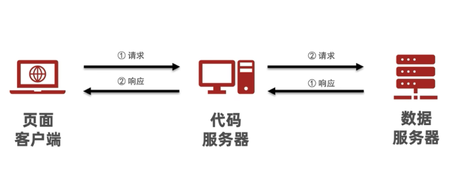
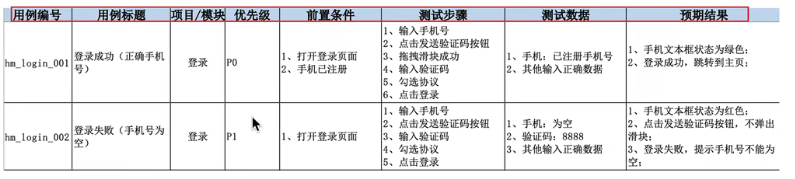
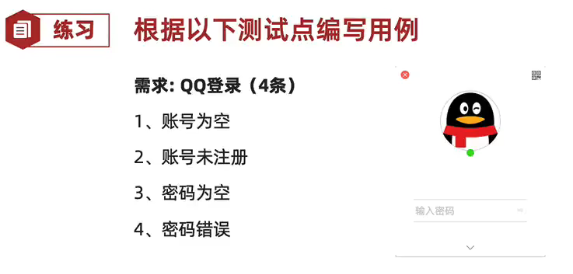
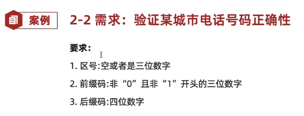
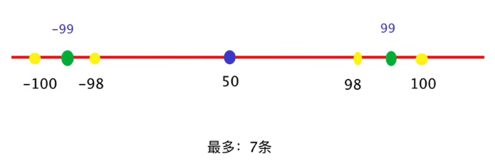
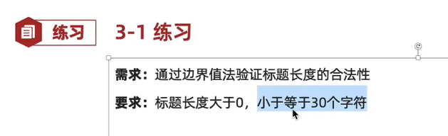

1. # 测试基础理论

## 一、测试的一些基本概念


### 1.软件和软件测试的概念：

​	**软件**是控制计算机硬件工作的工具

​	**软件测试**是使用技术手段验证软件是否满足使用需求


### 2.软件测试的目的：

​	发现软件缺陷(bug)，验证需求是否实现，评估软件质量(功能/性能/安全)


### 3.软件的基本组成：

​	

### 4.测试的主流技术：

- **功能测试**：测试主要验证程序的**功能**是否满足需求
- **自动化测试**：使用**代码或工具**代替手工，对项目进行测试
- **接口测试**：使用代码或工具验证程序中的**接口**是否访问正常
- **性能测试**：模拟**多人**使用软件，查找服务器缺陷


### 5.测试分类：

#### 1）按阶段

- **单元测试**：针对程序源代码进行测试(开发者)
- **集成测试**：又称接口测试，针对模块之间访问地址进行测试(模块交互)
- **系统测试**：对整个系统进行测试包括功能、兼容、文档等测试(全流程)
- **验收测试**：主要分为内测、公测，使用不同人群来发掘项目缺陷(客户)

#### 2）按代码可见度划分

- **黑盒测试**

1. 源代码不可见
2. UI功能可见

- **灰盒测试**

1. 部分源代码可见
2. 功能不可见

- **白盒测试**

1. 全部代码可见
2. UI功能不可见


### 6.质量模型：

- **功能**
- **性能**
- **兼容**
- **易用**
- **安全**
- 可靠性
- 移植性
- 维护性


### 7.测试流程：

1. **需求评审**：确保各部门需求理解一致
2. **计划编写**：测什么、谁来测、怎么测
3. **用例设计**：验证项目是否符合需求的操作文档
4. **用例执行**：项目模块开发完成开始执行用例文档实施测试
5. **缺陷管理**：对的缺陷进行管理的过程
6. **测试报告**：实施测试结果文档


## 二、测试用例

### 1.测试用例：

- 为测试项目而设计的测试文档


### 2.测试用例的作用：

- 防止漏测

- 实施测试的标准

  

### 3.用例设计编写格式：



### 4.用例设计编写格式-说明：

- **用例编号**：项目_模块 _编号
- **用例标题**：预期结果(测试点)
- **项目/模块**：所属项目或模块
- **优先级**：表示用例的重要程度或影响力P0~P4(P0最高)
- **前置条件**：要执行此条用例，有哪些前置操作
- **测试步骤**：描述操作步骤
- **测试数据**：操作的数据，没有的话可以为空
- **预期结果**：期望达到的结果+不同角色隐性结果


### 5.案例_练习QQ登录(测试用例 _案例练习)



## 三、测试用例设计

### 1.对穷举场景设计测试点

#### 1）等价类划分法

1. 说明：在所有测试数据中，具有某种**共同特征**的数据集合进行划分。

2. 分类：

   - **有效等价类**：满足需求的数据集合
   - **无效等价类**：不满足需求的数据集合

3. 步骤：

   1. 明确需求
   2. 确定有效和无效等价类(长度、类型和规则)
   3. 提取数据编写测试用例
      - **正向用例**：一条尽可能覆盖多条
      - **逆向用例**：每一条数据，都是一条单独用例。

   ```
   重点：有效等价和单个无效等价各取1个即可
   tips：完整的用例应该是等价类和边界值一块写。
   ```

   

4. **案例（在等价类用例_案例练习）：**

   

   

5. **案例实践(在等价类用例_案例练习)**

   )

6. 适用场景

   - 针对：需要有大量数据测试输入，但是没法**穷举测试**的地方
     - 输入框
     - 下拉列表
     - 单选复选框
   - 典型代表：页面输入框类测试。


### 2.解决边界限制问题

>说明：使用边界值解决界位数限制问题。

1. 边界范围节点：
   - **上点**：边界上的点(正好等于)
   - **离点**：距离上点最近的点(刚好大于、刚好小于)
   - **内点**：范围内的点(区间范围内的数据)



```
提示：
	1、有关范围限制，最多7条用例(暂时未优化)
	2、边界值能解决位数限制问题，但不能解决类型问题(要结合等价类)
```

2.边界值法设计用例步骤：

```
1、明确需求
2、确定有效和无效等价类(类型)
3、确定边界范围值
4、提取数据编写测试用例
```

3.**标题边界案例(边界值_案例练习)**



4.**QQ号码边界案例（边界值_案例练习）**


#### 5.边界值优化

>重点：开内闭外(开区间选包含的点，闭区间选不包含的点)
>
>开区间：不包含边界的店(没有等号)。如：0<a<10	(0,10)
>
>闭区间：包含边界上的店(有等号)。如：0<=a<=10	[0,10]

优化策略：

- 结论：**7个优化为5个点**
- 上点：必选(不考虑区间开闭)
- 内点：必选(建议选中间范围)
- 离点：**开内闭外**(考虑开闭区间，开区间选择内部离点，闭区间选择外部离点)

```
其实就是只选 一个范围之外 的点的优化方法。
```

6.使用场景：

> 强调：单个输入框，常用的方式 边界+等价类

```
在等价类的基础上去针对有边界范围的测试数据输入的地方(重点关注边界)
常见词语描述：大小、尺寸、重量、最大、最小、至多、至少等修饰词语
典型代表：有边界范围的输入框类测试
```

